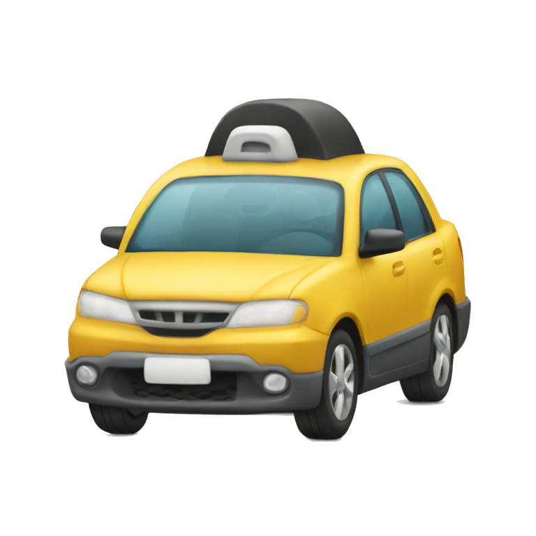

# Rideshare Dispatch Simulator 

## Overview

This project is a **Rideshare Dispatch Simulator** designed to simulate a ride-sharing business. The system models customers requesting rides through a ride-sharing app, simulating wait times, ride durations, and driver management based on customer requests. The simulator provides insights into key metrics such as average wait times and the number of rides handled by each driver.

## Features

The simulator supports the following features:
- **Customer Ride Requests**:
    - Customer ID
    - Starting location
    - Destination
    - Anticipated ride distance
    - Request time
    - Ride type, with priorities:
        - Express pick-up (Highest priority)
        - Standard pick-up
        - Wait-and-save pick-up
        - Environmentally conscious pick-up (Lowest priority)

- **Event Management**:
    - Two types of events:
        1. **Ride Requested Event**: Triggered when a new ride is requested.
        2. **Ride Finished Event**: Triggered when a ride is completed.

- **Ride Assignment**:
    - Assigns rides to available drivers based on priority.
    - If no drivers are available, the customer is added to a queue, and rides are assigned based on priority and arrival time.

- **Statistics**:
    - Tracks:
        - Time the ride was requested
        - Time the ride finished
        - Ride length (distance)
    - Outputs:
        - **Average wait time** for a ride
        - **Average number of rides handled** by each driver

## Simulation Scenarios

The system is designed to simulate the following scenarios:
- 50 drivers and 25 rides
- 50 drivers and 100 rides
- 50 drivers and 250 rides

For each scenario, the system provides:
- **Average wait time** for a ride
- **Average number of rides handled** by a driver

## Classes Overview

### 1. RideRequest
- **Attributes**:
    - `String customerId`
    - `int priority`
    - `String startLocation`
    - `double distance`
    - `RideType type`
    - `LocalDateTime requestTime`
    - `String destination`
- **Methods**:
    - `equals(Object)`: `boolean`
    - `hashCode()`: `int`

### 2. RideshareDispatchSimulator
- **Attributes**:
    - `int totalRides`
- **Methods**:
    - `calculateStats()`: `void`
    - `processNextEvent()`: `void`
    - `runSimulation(int drivers)`: `void`
    - `addRideRequest(RideRequest request)`: `void`
    - `finishRide(RideRequest request)`: `void`
    - `generateRandomRideRequest(int numberOfRides)`: `RideRequest`

### 3. Driver
- **Attributes**:
    - `int ridesHandled`
    - `boolean available`
- **Methods**:
    - `finishRide()`: `void`
    - `takeRide()`: `void`

### 4. Event
- **Attributes**:
    - `LocalDateTime eventTime`
- **Methods**:
    - `processEvent(RideshareDispatchSimulator simulator)`: `void`

### 5. RideRequestedEvent (inherits Event)
- **Attributes**:
    - `LocalDateTime eventTime`
    - `RideRequest request`
- **Methods**:
    - `processEvent(RideshareDispatchSimulator simulator)`: `void`

### 6. RideFinishedEvent (inherits Event)
- **Attributes**:
    - `LocalDateTime eventTime`
    - `RideRequest request`
- **Methods**:
    - `processEvent(RideshareDispatchSimulator simulator)`: `void`

### 7. RideType
- **Attributes**:
    - `int priority`
- **Methods**:
    - `values()`: `RideType[]`
    - `valueOf(String)`: `RideType`

## Event-Driven Simulation

- The system uses **priority queues** to handle ride requests and active rides.
- Events are processed based on priority, with customers served according to their ride type.
- Active rides are managed by departure time and expected ride duration (assuming an average speed of 60 mph).

## Sample
```
Enter the number of drivers: 50
Simulation running...

Average wait time for a ride: 5.2 minutes
Average rides handled by a driver: 2.1
```